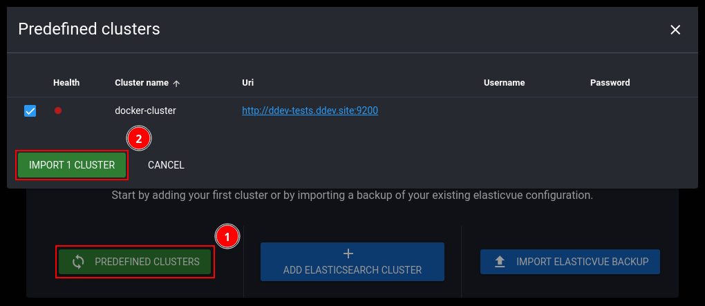

[](https://addons.ddev.com)
[](https://github.com/2ndkauboy/ddev-elasticvue/actions/workflows/tests.yml?query=branch%3Amain)
[](https://github.com/2ndkauboy/ddev-elasticvue/commits)
[](https://github.com/2ndkauboy/ddev-elasticvue/releases/latest)

# DDEV Elasticvue

## Overview

This add-on integrates Elasticvue into your [DDEV](https://ddev.com/) project.

## Installation

```bash
ddev add-on get 2ndkauboy/ddev-elasticvue
ddev restart
```

After installation, make sure to commit the `.ddev` directory to version control.

## Usage

| Command                   | Description |
|---------------------------| ----------- |
| `ddev describe`           | View service status and used ports for Elasticvue |
| `ddev logs -s elasticvue` | Check Elasticvue logs |

## Configuration

The add-on assumes that the Elasticsearch service is named `elasticsearch`. If this is the case, you can import the predefined cluster on the welcome screen:



1. Click on the `Predefined Clusters` button.
2. Click on the `Import 1 Cluster` button.

This only needs to be done the first time you use this for a new project. If your clusters are named differently, you can use the "Add Elasticsearch Cluster" button. If you have other issues, refer to the official website or GitHub repository of Elasticvue listed below.

## Additional Resources

- [Elasticvue official website](https://elasticvue.com/).
- [Elasticvue GitHub repository](https://github.com/cars10/elasticvue).

## Credits

**Elasticvue is maintained by [@cars10](https://github.com/cars10)**  
**DDEV Elasticvue is maintained by [@2ndkauboy](https://github.com/2ndkauboy)**