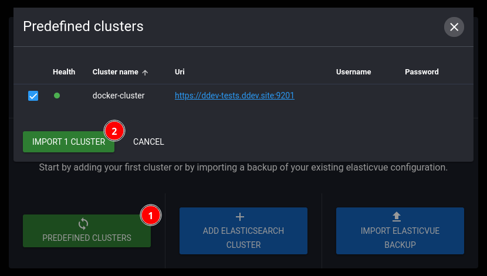

[](https://github.com/2ndkauboy/ddev-elasticvue/actions/workflows/tests.yml) 

# DDEV Elasticvue

## What is ddev-elasticvue?

This repository allows you to quickly install Elasticvue into a [DDEV](https://ddev.readthedocs.io) project using just `ddev get 2ndkauboy/ddev-elasticvue`.

## Installation

```
ddev get 2ndkauboy/ddev-elasticvue && ddev restart
```

You can then visit Elasticvue by running `ddev elasticvue` or visiting the URL shown in `ddev describe`.

## Configuration

The add-on assumes that the Elasticsearch service is named `elasticsearch` and the (only) cluster is named `docker-cluster`. If this is the case, you can import the predifened cluster on the welcome screen:



1. Click on the `Predefined Clusters` button
2. Click on the `Import 1 Cluster` button

This only need to be done the first time you use this for a new project. If your clusters are named differently, you can use the "Add Elasticsearch Cluster" button. If you have other issues, refer to the official website or GitHub repository of Elasticvue listed below.


## Explanation

Elasticvue is a free and open-source gui for elasticsearch that you can use to manage the data in your cluster.

## Additional Resources

- [Elasticvue official website](https://elasticvue.com/)-
- [Elasticvue GitHub repository](https://github.com/cars10/elasticvue).

**Elasticvue is maintained by @cars10**
**DDEV Elasticvue is maintained by @2ndkauboy**
